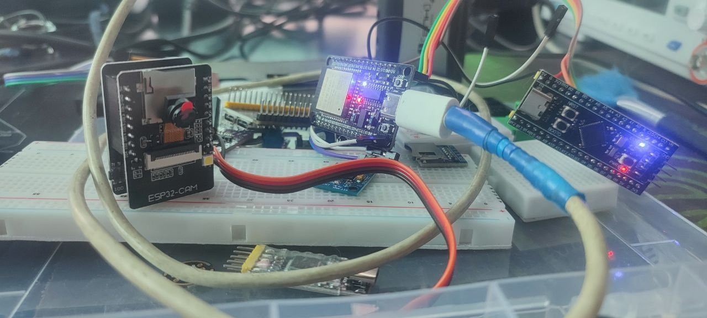

# 📡 Документація до ESP32 SPI Master (ESP-IDF. SPIESP32TOSTM32)

Цей код реалізує **SPI-мастер** на ESP32, який передає байт `0x42` через SPI, отримує відповідь від SPI-slave (наприклад, STM32), і моргає світлодіодом у разі успішного обміну.




---

## 📦 Включені заголовки

```c
#include "driver/spi_master.h"
#include "driver/gpio.h"
#include "esp_log.h"
#include "rom/gpio.h"
#include <string.h>
```

Ці заголовки потрібні для:

- керування SPI (spi_master.h)

- налаштування GPIO (gpio.h)

- логування (esp_log.h)

- базових функцій (string.h, rom/gpio.h)

## 🔌 Визначення пінів

```c
#define PIN_NUM_MISO 19
#define PIN_NUM_MOSI 23
#define PIN_NUM_CLK  18
#define PIN_NUM_CS   5
#define PIN_NUM_LED  2
```

SPI пін-конфігурація:

- MISO ← від Slave

- MOSI → до Slave

- CLK → тактова

- CS → chip select

- **PIN_NUM_LED** — вбудований світлодіод ESP32 (GPIO2)

## 🔧 Ініціалізація

GPIO для LED

```c
gpio_pad_select_gpio(PIN_NUM_LED);
gpio_set_direction(PIN_NUM_LED, GPIO_MODE_OUTPUT);
gpio_set_level(PIN_NUM_LED, 0);
```

- LED вимикається на старті.

## 🛠 Конфігурація SPI

**Bus config**

```c
spi_bus_config_t buscfg = {
    .miso_io_num = PIN_NUM_MISO,
    .mosi_io_num = PIN_NUM_MOSI,
    .sclk_io_num = PIN_NUM_CLK,
    .quadwp_io_num = -1,
    .quadhd_io_num = -1,
    .max_transfer_sz = 1,
};
```

- Звичайна SPI-шина без Quad режиму.

- Передача одного байта за раз.

**Device config**

```c
spi_device_interface_config_t devcfg = {
    .clock_speed_hz = 1 * 1000 * 1000,
    .mode = 0,
    .spics_io_num = PIN_NUM_CS,
    .queue_size = 1,
};
```

- Швидкість SPI: 1 МГц

- Режим SPI: Mode 0 (CPOL=0, CPHA=0)

- CS керується апаратно

## 🔄 Основний цикл

**Змінні:**

```c
uint8_t tx_data = 0x42; // Байт на передачу
uint8_t rx_data;        // Байт для прийому
```

**Транзакція:**

```c
spi_transaction_t t;
memset(&t, 0, sizeof(t));
t.length = 8;
t.tx_buffer = &tx_data;
t.rx_buffer = &rx_data;
```

**Цикл передачі:**

```c
while (1) {
    spi_device_transmit(spi, &t);

    // Якщо успішно — лог і миготіння LED
    gpio_set_level(PIN_NUM_LED, 1);
    vTaskDelay(pdMS_TO_TICKS(100));
    gpio_set_level(PIN_NUM_LED, 0);

    vTaskDelay(pdMS_TO_TICKS(900)); // загальна пауза — 1 секунда
}
```

- Щосекунди передається 1 байт (0x42).

- Якщо відповідь отримано — світлодіод блимає на 100 мс.

- В лог виводиться:

```
Sent: 0x42, Received: 0xAB
```

## 🧪 Взаємодія з STM32 (Slave)

Цей код сумісний з попереднім STM32 SPI Slave:

- STM32 завжди повертає 0xAB.

- ESP32 передає 0x42, очікує відповідь.

У разі успішного обміну:

- У лог — Sent: 0x42, Received: 0xAB

- LED блимає.

## 📈 Потенційні розширення

- Обробка отриманих даних (rx_data) для прийому команд або статусів.

- Використання черги передач (queue_size > 1) для асинхронних транзакцій.

- Виведення результатів на дисплей або відправка через Wi-Fi.

## ✅ Підсумок

ESP32:

- Виконує SPI Master передачу в режимі Mode 0.

- Передає 0x42 → очікує відповідь 0xAB від STM32.

- Лог і миготіння LED підтверджують активну комунікацію.

